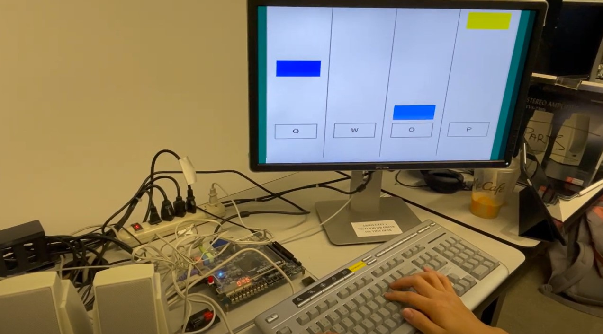

# Rhythm Game - Piano Tiles Clone



## Overview

This project is a rhythm game similar to the popular game **Piano Tiles**. The player must time their button inputs in sync with the music and the moving tiles to achieve a high score. The game is designed to run on the **Nios II Monitor Program** and the **DE1-SoC** board.

### Made by Eason Chou and Yihao Lin for ECE243 - Computer Organization

## Video Demo

[Watch the Video Demo](https://youtu.be/g_SRKAhhgUU?si=hU0ohW2wd8ksbmVh)

## Features

- **Timing-Based Gameplay:** Match your inputs with the rhythm of the music to score points.
- **High Score Tracking:** Keep track of your best performances.
- **Simple Controls:** Designed for easy and intuitive gameplay.

## Installation

1. **Clone the Repository:**
   ```bash
   git clone https://github.com/yourusername/rhythm-game.git
   ```

2. **Navigate to the Project Directory:**
   ```bash
   cd rhythm-game
   ```

3. **Compile and Run on Nios II Monitor Program:**
   - Use the provided `rhythm_game_one_file.c` to run the game on the Nios II Monitor Program and DE1-SoC board.
   - Follow your usual process for compiling and uploading code to the DE1-SoC board.

## Usage

1. **Load the Game:**
   - Load `rhythm_game_one_file.c` onto your DE1-SoC board using the Nios II Monitor Program.

2. **Start Playing:**
   - Follow the on-screen prompts to start the game.
   - Press the appropriate buttons in sync with the music and tiles.

3. **Aim for a High Score:**
   - Keep playing to improve your timing and score higher!

## Development

This game was developed as part of the coursework for **ECE243 - Computer Organization**. It leverages the DE1-SoC's hardware capabilities to create an engaging, timing-based gameplay experience.
